# AiREAK Entertainment Platform

AiREAK là nền tảng giải trí kết hợp mạng xã hội (bài viết, bình luận, kết bạn, chat realtime) và xem phim trực tuyến (tìm phim, HLS streaming, phòng xem cùng nhau), xây dựng theo kiến trúc microservices với Spring Boot và React.

## Quick Start — Docker Compose

Đây là cách chạy được khuyến nghị cho người mới clone dự án.

### Yêu cầu

- Git và Docker Desktop/Docker Compose.
- PowerShell 5.1+ trên Windows; Linux/macOS cần PowerShell 7 (`pwsh`) để dùng script sinh secret.
- Nên cấp khoảng 8 GB RAM cho Docker Desktop vì hệ thống gồm nhiều database, Kafka và microservice.

### 1. Clone và tạo cấu hình local

Windows PowerShell:

```powershell
git clone https://github.com/Minh-aireak/entertainment-web.git
Set-Location entertainment-web
Copy-Item .env.example .env
```

Linux/macOS:

```bash
git clone https://github.com/Minh-aireak/entertainment-web.git
cd entertainment-web
cp .env.example .env
```

Nếu cần Google Login, gửi email hoặc upload/media, hãy điền credential Google OAuth2, Brevo và Backblaze B2 của riêng bạn vào `.env`. Có thể giữ placeholder để chạy chức năng lõi, nhưng các tích hợp tương ứng sẽ không hoạt động.

Sinh toàn bộ credential nội bộ và cấu hình Debezium:

```powershell
Set-ExecutionPolicy -Scope Process -ExecutionPolicy Bypass
.\scripts\rotate-local-secrets.ps1
```

Trên Linux/macOS:

```bash
pwsh -File ./scripts/rotate-local-secrets.ps1
```

### 2. Build và chạy

```powershell
docker compose up -d --build
docker compose ps
```

Lần đầu sẽ lâu hơn do Docker phải tải image hạ tầng và build toàn bộ service. Khi các container đã sẵn sàng, mở http://localhost:5173.

Tài khoản demo:

```text
Username: nguyenminhan
Password: admin
Role: USER
```

## Demo / Ảnh chụp màn hình

### Đăng nhập

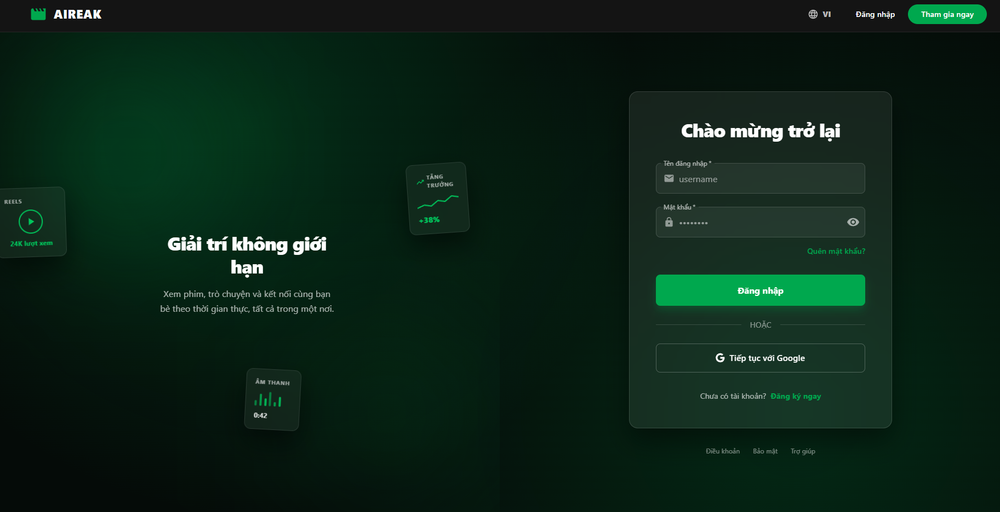

### Bảng tin mạng xã hội

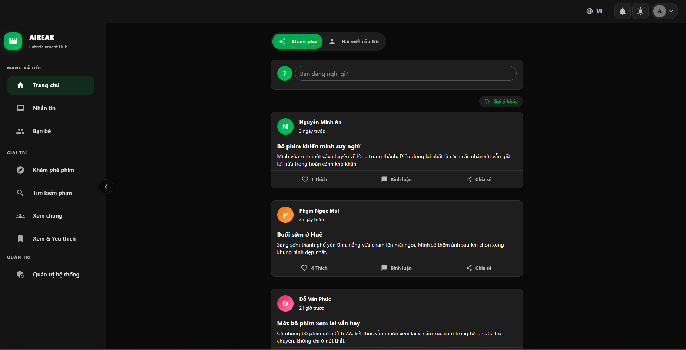

### Chat realtime

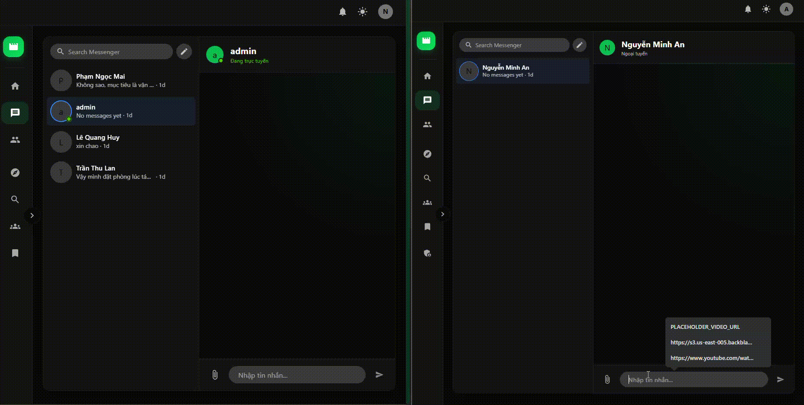

### Bạn bè và gợi ý kết bạn

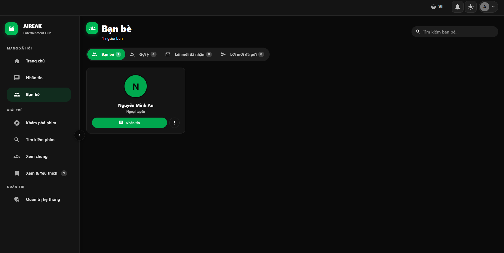

### Khám phá phim


### Tìm kiếm phim


### Chi tiết phim và xem phim

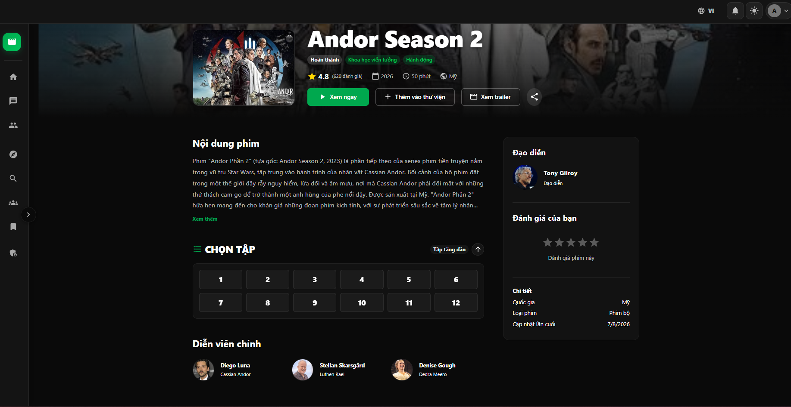

### Xem phim


### Tiếp tục xem

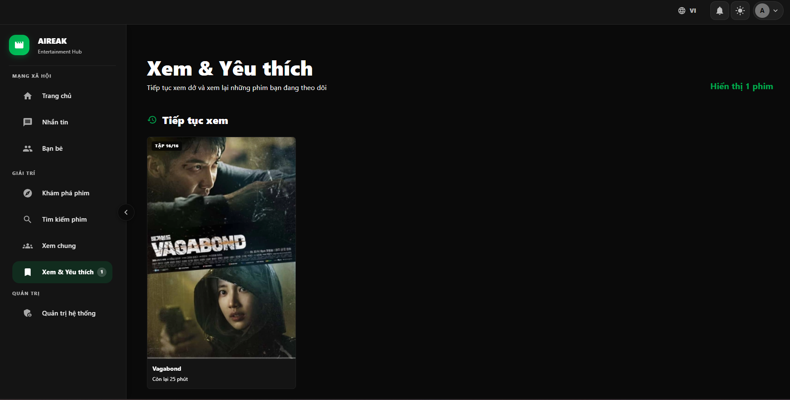

### Xem cùng nhau


### Tổng quan trang quản trị

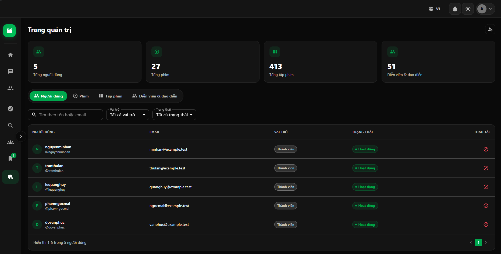

### Quản lý phim

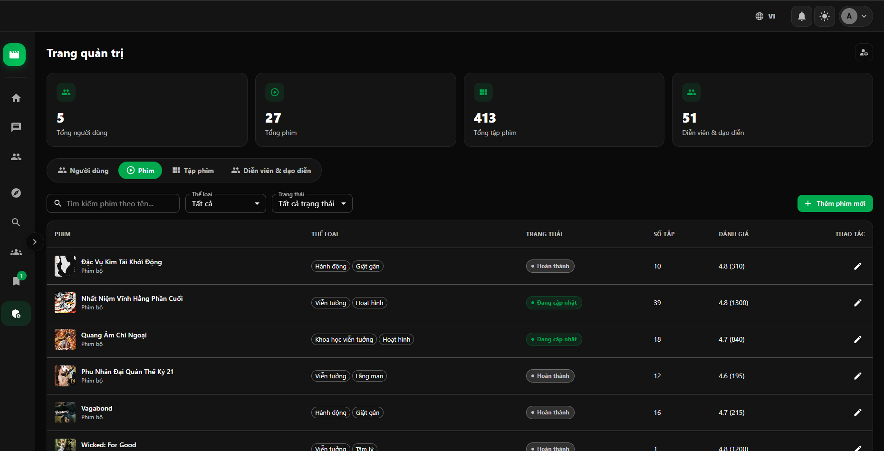

### Quản lý tập phim

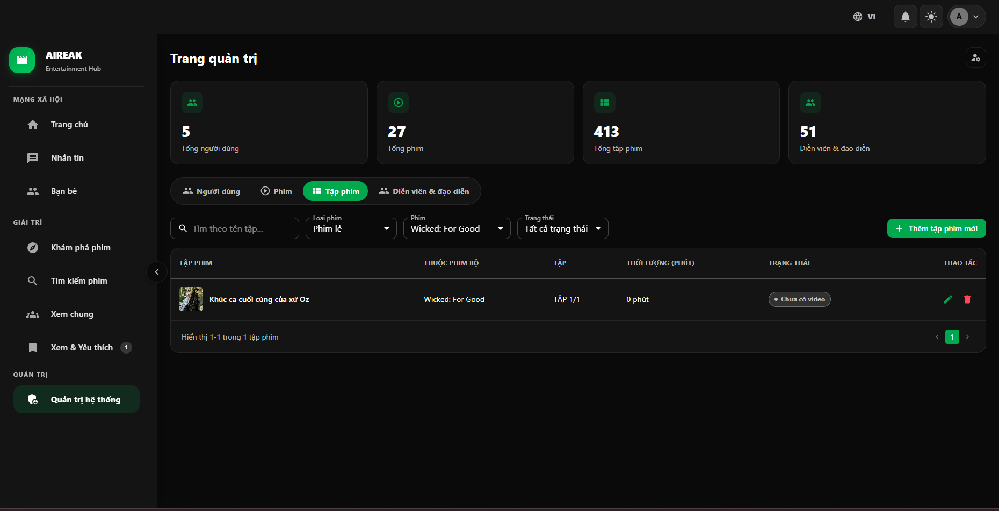

### Quản lý diễn viên & đạo diễn

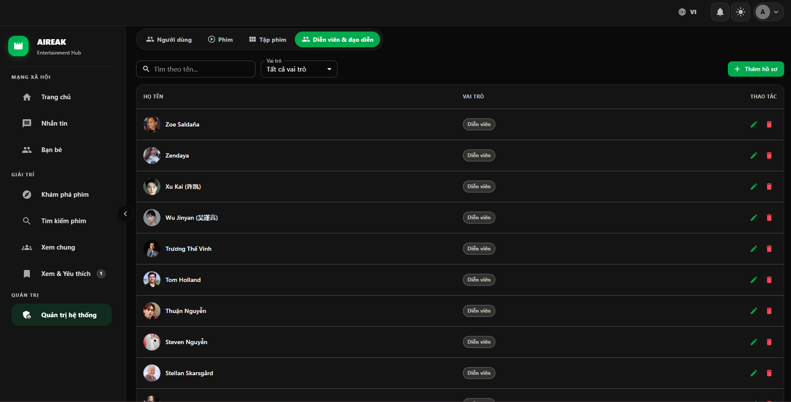

### Upload và cập nhật tập phim

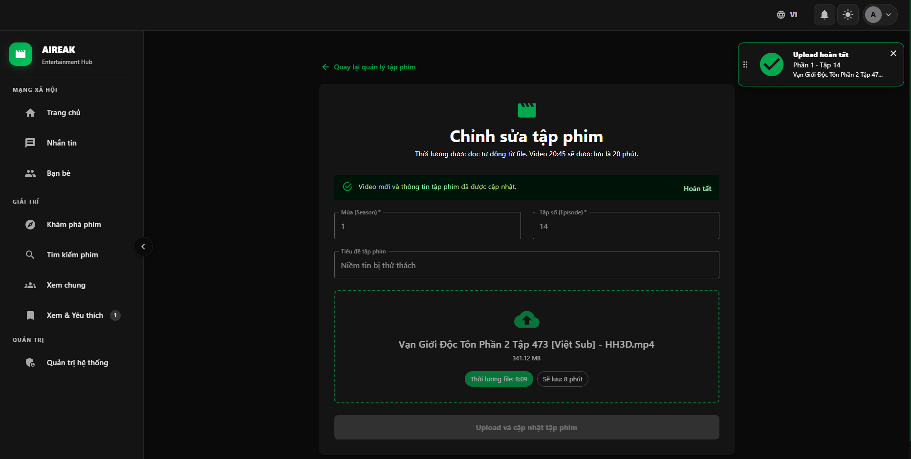

## Tính năng chính

**Tài khoản và bảo mật**

- Đăng ký/đăng nhập bằng username-password và Google OAuth2.
- JWT, đặt lại mật khẩu và phân quyền `ADMIN`/`USER`. Luồng quên mật khẩu hiện tạo token/outbox nhưng email tự động đang bị chặn bởi regression consumer nêu ở mục Giới hạn.
- Rate limit tại API Gateway và từng identity endpoint nhạy cảm.

**Mạng xã hội**

- Bài viết, news feed, bình luận và reaction.
- Kết bạn, gợi ý/tìm kiếm người dùng.
- Chat realtime, trả lời/sửa/xóa tin nhắn và đính kèm file.
- Thông báo realtime qua WebSocket và email qua Brevo.
- Upload avatar/tệp qua presigned URL của Backblaze B2.

**Phim**

- Danh mục, tìm kiếm, chi tiết phim, đánh giá và mục "Xem & Yêu thích" (theo dõi phim + tiếp tục xem).
- Streaming HLS bằng `hls.js`, quản lý/upload tập phim.
- Tự động lưu vị trí đang xem và xem tiếp đúng chỗ đã dừng (Tiếp tục xem).
- Phòng xem cùng nhau có lobby/chat realtime, quyền Host/Viewer, đồng bộ tập phim, vị trí và tốc độ phát.
- Trang quản trị phim, tập phim (tìm kiếm/lọc toàn bộ tập phim theo phim và trạng thái), diễn viên & đạo diễn, vai trò và người dùng.

**Dữ liệu và tích hợp**

- Đa ngôn ngữ ở frontend.
- Kafka + Debezium CDC với service quản lý connector riêng.
- Redis cache và Elasticsearch cho tìm kiếm.

## Công nghệ sử dụng

**Backend**

- Java 24, Spring Boot 3.4.5, Spring Cloud 2024.0.1.
- Spring Cloud Gateway, Spring Security, OAuth2 Resource Server và JWT.
- OpenFeign, Resilience4j, JPA/Hibernate và Spring Data MongoDB.
- MySQL, MongoDB, Redis, Elasticsearch, Kafka KRaft và Debezium.
- JUnit 5, Mockito, Spring Boot Test, Testcontainers và H2.

**Frontend**

- React 19, TypeScript, Vite 8 và React Router 7.
- MUI 9, Tailwind CSS 4, Emotion, Redux Toolkit và Axios.
- `hls.js`, i18next, Vitest, React Testing Library và ESLint.

**Hạ tầng**

- Docker Compose cho môi trường local.
- Dockerfile riêng cho từng service; frontend production phục vụ qua Nginx.
- Maven Wrapper nên không cần cài Maven riêng.

## Sơ đồ kiến trúc

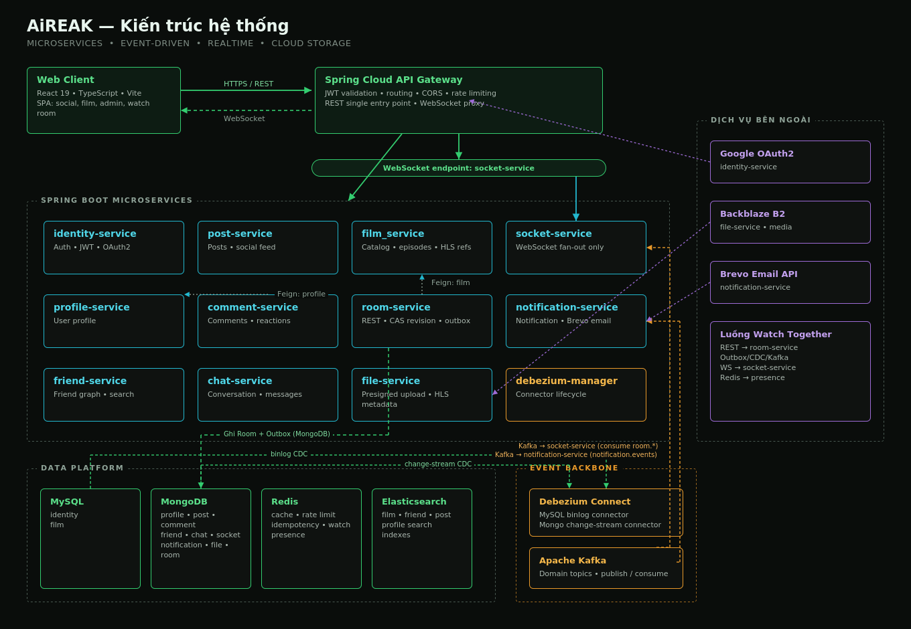

## Cấu trúc thư mục

```text
entertainment-web/
├── frontend/                   # React + Vite SPA
├── api-gateway/                # Gateway, JWT và routing
├── identity-service/           # Auth, role và user (MySQL)
├── profile-service/            # Hồ sơ người dùng (MongoDB)
├── post-service/               # Bài đăng (MongoDB + Elasticsearch)
├── comment-service/            # Bình luận (MongoDB)
├── friend-service/             # Quan hệ bạn bè và tìm kiếm
├── chat-service/               # Hội thoại/tin nhắn (MongoDB)
├── socket-service/             # WebSocket realtime
├── notification-service/       # Thông báo và email
├── file-service/               # File, B2 và HLS
├── film_service/               # Phim/tập phim (MySQL + Elasticsearch)
├── room-service/               # Phòng xem cùng nhau
├── debezium-manager/           # Quản lý Debezium connector
├── common*/                    # Thư viện dùng chung
├── infrastructure/db-init/     # Init database và seed dữ liệu
├── scripts/                    # Công cụ local, bảo mật và bảo trì seed
├── docs/                       # Sơ đồ kiến trúc và ảnh minh họa
├── docker-compose.yml
├── pom.xml
└── .env.example
```

## Chạy bằng Docker Compose

`docker compose up -d --build` chạy hạ tầng, init/seed database, các microservice và frontend. `mongo-init` phải hoàn tất trước những service dùng MongoDB. Seed dùng ID cố định và thao tác idempotent nên chạy lại không tạo bản ghi trùng; dữ liệu người dùng khác không bị xóa.

Các container hạ tầng (`mysql`, `mongodb`, `kafka`, `redis`, `elasticsearch`, `connect` và job `mongo-init`) đều dùng `restart: "no"`. Vì vậy chúng không tự chạy lại chỉ vì Docker daemon/Docker Desktop khởi động; chúng chỉ chạy khi người dùng chủ động dùng `docker compose up`, `docker compose start` hoặc script vận hành. Tuy nhiên, `docker compose up <service>` vẫn có thể khởi động các dependency trong `depends_on`; script `start-compose-sequential.ps1` cũng chủ đích khởi động toàn bộ stack.

Khi chỉ rebuild một service và toàn bộ dependency đã sẵn sàng, dùng `--no-deps` để không kéo hạ tầng hoặc service liên quan lên lại:

```powershell
docker compose up -d --build --no-deps room
docker compose up -d --build --no-deps socket
docker compose up -d --build --no-deps web-app
```

Các file `data.sql` của `identity-service` và `film_service` được kiểm tra mỗi lần service khởi động. Marker/`INSERT IGNORE` bảo vệ dữ liệu đã tồn tại thay vì reset toàn bộ database.

Máy yếu dùng script tuần tự; script luôn chờ service hiện tại mở cổng trước khi build/chạy service kế tiếp:

```powershell
.\scripts\start-compose-sequential.ps1
```

Linux/macOS dùng `pwsh -File ./scripts/start-compose-sequential.ps1`. Xem [scripts/README.md](scripts/README.md) để biết tác dụng và side effect của từng script.

Mọi lệnh rebuild riêng service trong tài liệu đều dùng `--no-deps`. Chỉ thực hiện khi dependency cần thiết đã chạy; nếu chưa, hãy start dependency bằng một lệnh riêng trước.

Dừng nhưng giữ dữ liệu:

```powershell
docker compose down
```

Xem trạng thái và log init:

```powershell
docker compose ps
docker compose logs -f mongo-init
```

## Dữ liệu demo và tài khoản quản trị

Năm tài khoản seed đều có role `USER` và mật khẩu `admin`:

- `nguyenminhan`
- `tranthulan`
- `lequanghuy`
- `phamngocmai`
- `dovanphuc`

Chỉ dùng các tài khoản này cho local/demo. Không triển khai mật khẩu mẫu ở production.

Admin mặc định bị tắt. Để tạo tài khoản `ADMIN` đầu tiên, đặt `BOOTSTRAP_ADMIN_ENABLED=true` trong `.env`, bảo đảm ba biến `BOOTSTRAP_ADMIN_*` đã có giá trị mạnh, rồi chạy:

```powershell
docker compose up -d --force-recreate identity
```

Sau khi admin được tạo, đặt lại `BOOTSTRAP_ADMIN_ENABLED=false` và recreate `identity` lần nữa. `false` chỉ vô hiệu hóa logic bootstrap khi service khởi động lại, không phải cơ chế phân quyền đọc `.env`; không commit `.env` chứa credential thật.

## Endpoint local

| Service | URL Docker Compose | Ghi chú |
|---|---|---|
| Frontend | http://localhost:5173 | Điểm truy cập giao diện |
| API Gateway | http://localhost:8888 | Điểm vào API/WebSocket |
| Identity | http://localhost:8080 | Auth |
| Profile | http://localhost:8081 | Hồ sơ |
| Notification | http://localhost:8082 | Thông báo/email |
| Post | http://localhost:8083 | Bài đăng |
| File | http://localhost:8084 | Upload/media/HLS |
| Chat | http://localhost:8086 | Chat |
| Friend | http://localhost:8087 | Bạn bè |
| Socket | http://localhost:8088 | WebSocket |
| Comment | http://localhost:8089 | Bình luận |
| Film | http://localhost:8090 | Catalog phim |
| Room | http://localhost:8091 | Xem cùng nhau |
| Debezium Manager | http://localhost:9000 | Quản lý connector |
| Debezium Connect | http://localhost:8100 | Kafka Connect REST |

Frontend chỉ gọi backend qua Gateway. Các cổng service trực tiếp phục vụ phát triển và chẩn đoán local.

## Chạy thủ công khi phát triển

Ngoài Docker, cần JDK 24 và Node.js 22+.

Khởi động hạ tầng cần thiết:

```powershell
docker compose up -d mysql mongodb
docker compose up -d --force-recreate mongo-init
docker wait mongo-init
docker compose up -d kafka redis elasticsearch connect
```

Spring Boot không tự đọc `.env` ở thư mục gốc. Hãy dot-source script sau để nạp biến vào process hiện tại và đổi Docker DNS thành `localhost`:

```powershell
Set-ExecutionPolicy -Scope Process -ExecutionPolicy Bypass
. .\scripts\import-local-env.ps1
.\mvnw.cmd -pl identity-service spring-boot:run
```

Chạy frontend dev:

```powershell
Set-Location frontend
npm ci
npm run dev
```

Vite mặc định chạy tại http://localhost:5173.

## Biến môi trường

Docker Compose đọc `.env`. File này bị Git ignore và chỉ file mẫu (`.env.example`) được phép commit.

## Kiểm thử và build

Backend:

```powershell
.\mvnw.cmd test
.\mvnw.cmd -pl debezium-manager test
.\mvnw.cmd -pl film_service test
```

Frontend:

```powershell
Set-Location frontend
npm ci
npm test
npm run lint
npm audit --omit=dev
npm run build
```

## Troubleshooting

Kiểm tra container lỗi:

```powershell
docker compose ps
docker compose logs --tail=200 <service-name>
```

Nếu port `5173`, `8888`, `3306` hoặc các cổng service đã bị chiếm, hãy dừng process/container đang dùng cổng hoặc đổi mapping phù hợp.

Nếu lần xoay credential MySQL bị gián đoạn và mật khẩu trong `.env` không còn đăng nhập được:

```powershell
.\scripts\rotate-local-secrets.ps1 -RecoverMySqlToCurrentEnv
```

Reset toàn bộ Docker volume sẽ xóa vĩnh viễn database local và chạy seed lại từ đầu:

```powershell
docker compose down -v
```

Chỉ chạy lệnh trên khi chắc chắn không cần dữ liệu hiện tại. Nếu metadata ảnh/video tồn tại nhưng media không tải được, hãy kiểm tra credential, bucket và object thật trên Backblaze B2.

